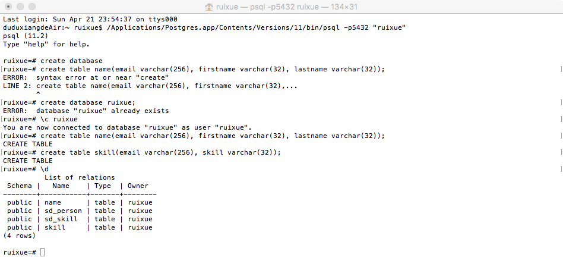
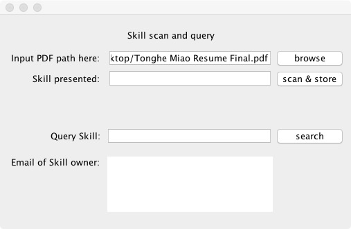
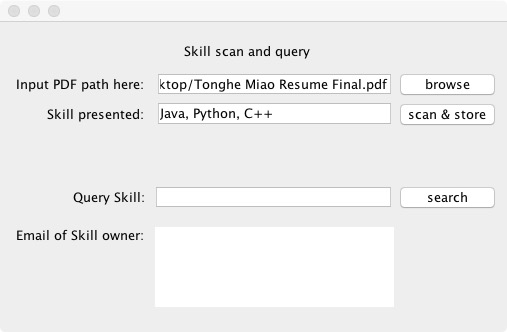
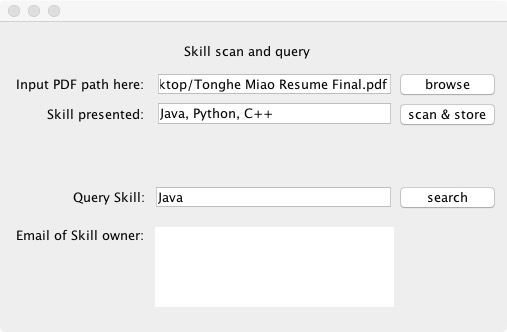
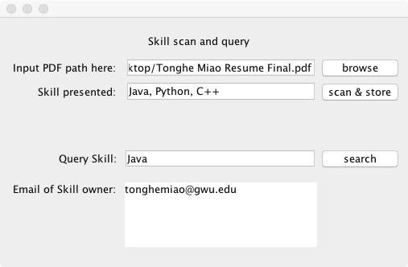

# Searching-Engine - The Dynamic PDF Reader     
Creator: Tonghe Miao 
# 1) Introduction 
This is a simple tutorial to show you how to extract information from PDF Resumes by using java.
# 2) Setting up Environment
Before compiling and running the source code, pdfbox, jdbc and postgreSQL needs to be downloaded, installed and properly added to the module path in java project.
The following links provide download and detailed instruction on how to configure each component:

Pdfbox: https://www.tutorialspoint.com/pdfbox/pdfbox_reading_text.html

Jdbc: https://jdbc.postgresql.org/download.html

PostgreSQL: https://www.tutorialspoint.com/postgresql/postgresql_java.htm
# 3) Creating Database
Creating your own database by using PostgreSQL

# 4) Following Gui Application
## Please download the source code from the guitest folder, and follow the gui application

## 4.1)Put down the path of a PDF Resume

## 4.2)Present skills from the PDF Resume, and store them in the database

## 4.3)Put down the skills you want to find from database

## 4.4)Show up the email of the owner with this skill in his/her resume.

